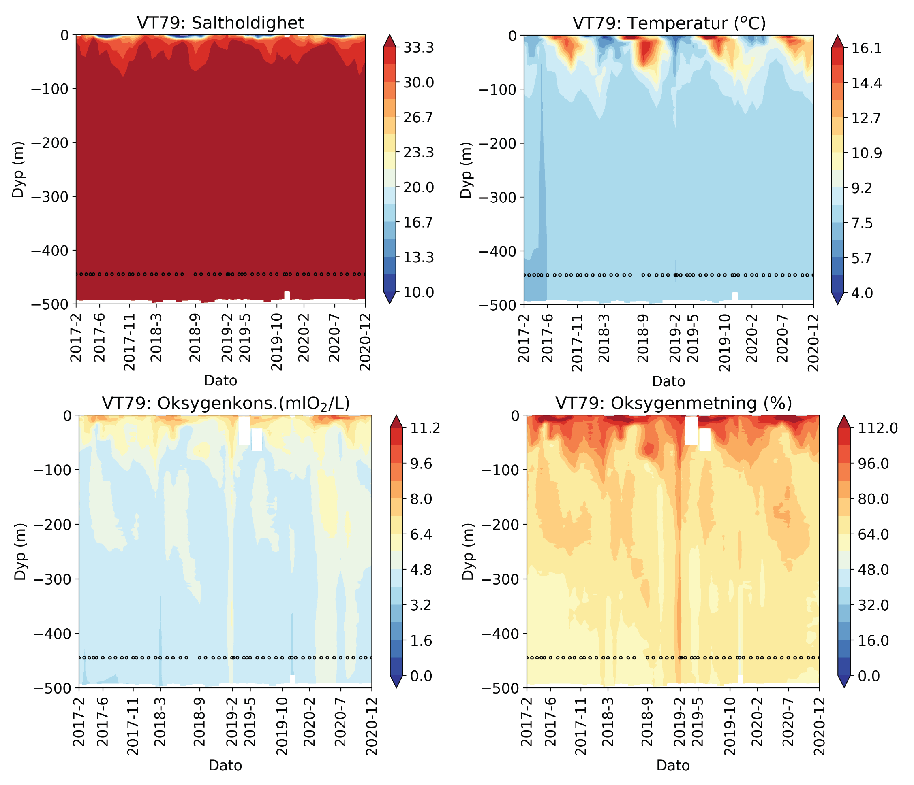
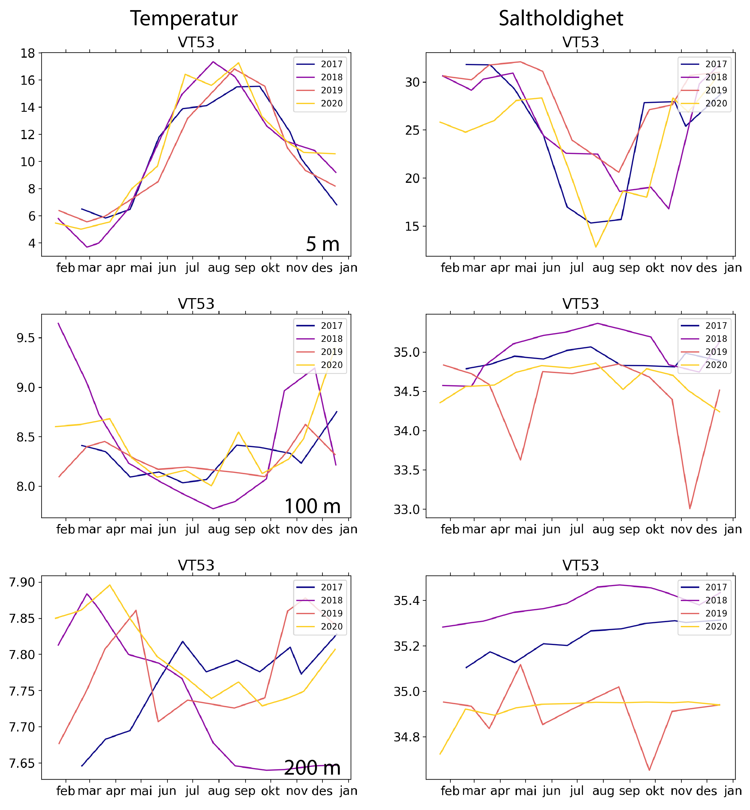

# okokyst_toolbox
Toolbox for processing, plotting, and calculating stats of SAIV CTD cast data from stations

### Usage:

 To make use of this toolbox you also need to install python-ctd package. 
 In the source code for python-ctd localte the folder ctd/read.py and replace the content with the content 
 of file functionSAIV.py. Next, add the new function to the `__init__.py` file
 within the `ctd` directory so that it looks like this:
 
```
from .read import from_bl, from_btl, from_cnv, from_edf, from_saiv, from_fsi, rosette_summary

 __all__ = [
    "bindata",
    "despike",
    "from_bl",
    "from_btl",
    "from_cnv",
    "from_edf",
    "from_fsi",
    "from_saiv",
    "lp_filter",
    "movingaverage",
    "plot_cast",
    "press_check",
    "remove_above_water",
    "rosette_summary",
    "smooth",
    "split",
]
```
 
Then recompile and install the python-ctd module using:
 `cd python-ctd
  pip install gsw
  pip install openpyxl
  pip install cmocean
  pip install xlsxwriter
  python setup.py develop
 `

 This adds the possibility to read SAIV files
 to the toolbox. The python-ctd toolbox is found here:
 https://github.com/pyoceans/python-ctd


 Run this using : python okokyst_processing.py
 Requires:
 Data to be located in folders with specific structure:
```
  =>/Users/trondkr/Dropbox/Sorfjorden_2017_2019/
  ==> 2018-09-07/
  ===> 2018-09-07 CTD data/
  ====> SOE10.txt
```

To create a time-series contour plot of CTD cast for a specific survey and stations (substations) define these and the datapaths in the 'main' function. Currently supported surveys are: 

* MON
* ØKOKYST (Sognefjorden and Hardangerfjorden)
* SØRFJORDEN

```Python
if survey == "Hardangerfjorden":
   basepath = "../OKOKYST_NS_Nord_Kvitsoy/"+str(CTDConfig.year)+"/"
   subStations = ["VT70", "VT69", "VT74", "VT53", "VT52", "VT75"]

if survey == "MON":
   basepath = "/Users/trondkr/Dropbox/MON-data/CONVERTED/"
   subStations = ['NORD1','OFOT1','NORD2', 'OFOT2','OKS1','OKS2',
                  'SAG1','SAG2','SJON1','SJON2','TYS1','TYS2']
            
if survey == "Sognefjorden":
   basepath = "../OKOKYST_NS_Nord_Leon/"+str(CTDConfig.year)+"/"
   subStations = ["VT16", "VT179"]
   ```

You run the toolbox after having editedt the settings in main with
```
python okokyst_processing.py
```


### Examples
Below is an example of various contour plots using this toolbox for station VT79 in 
Hardangerfjorden. Data period is monthly from 2017 to December 2020:


You can also plot timeseries for stations VT53:

